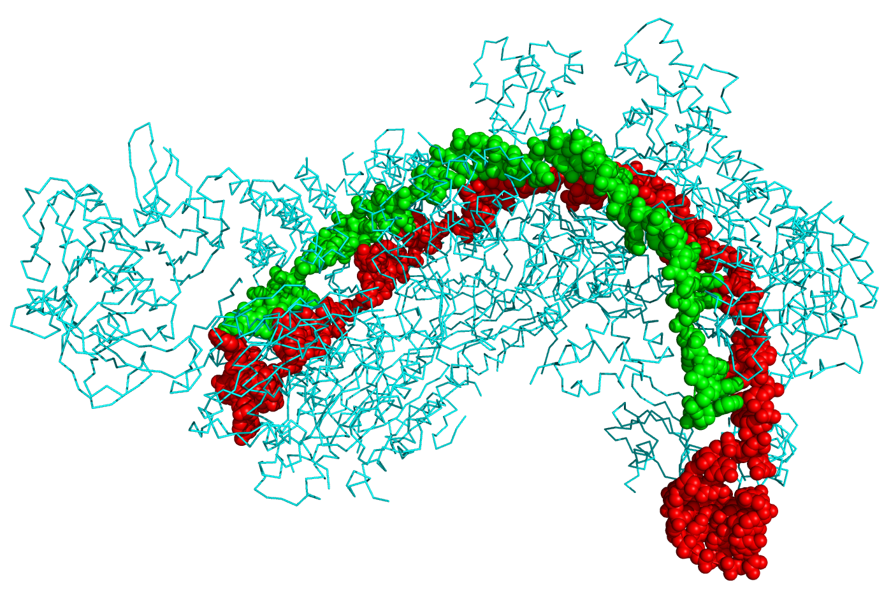

[Back to the main page of the crash course](../index.html)

# CRISPR-Cas9

---

## Learning outcomes
- Pipetting in μl ranges
- Design of a CRISPR system in bacteria
- Using CRISPR to supress the erxpression of a gene in bacteria
- Creating competent *E. coli*
- Transformation of bacteria
- Selection of recombinant clones
- Use qPCR to confirm knock-down of gene

---
## Protocol

--- 

[Back to the main page of the crash course](../index.html)