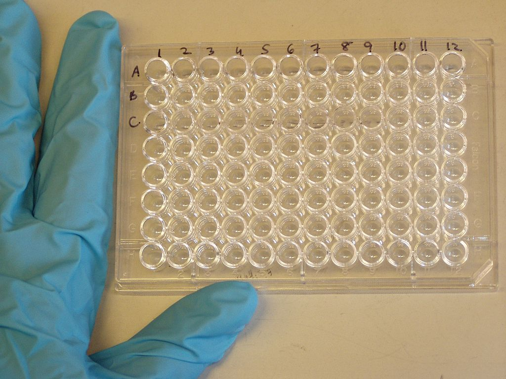

[Back to the main page of the crash course](../index.html)

# Enzyme-linked immunosorbent assay (ELISA)

---

## Learning outcomes
- Pipetting in μl ranges
- Learning the principle of the ELISA test
- Spectometry
- Data analysis in Excel

---
## Protocol

--- 

[Back to the main page of the crash course](../index.html)