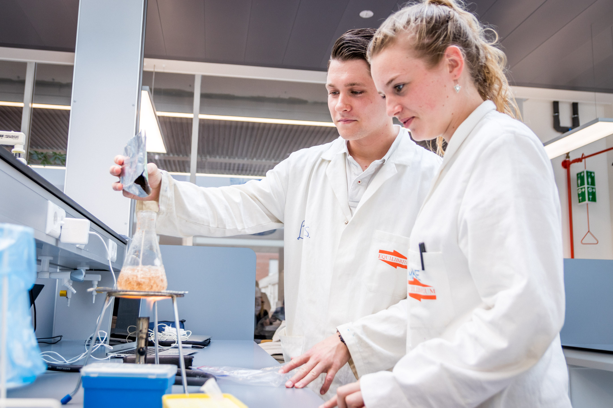

# Laboratory courses

## Main Page
---

## Courses
- [Crash Course](./short/short.html) (3 days of 6 hours each)
- [VMT](./vmt/vmt.html) (1 day of 6 hours)
- [Nucleic acid isolation](./nucleic_acid_isolation/nucleic_acid_isolation.html) (1 day of 6 hours)
- [PCR](./pcr/pcr.html) (2 days of 6 hours each)
- [ELISA](./elisa/elisa.html) (1 day of 6 hours)
- [Western Blot](./western_blot/western_blot.html) (2 days of 6 hours each)
- [Cloning](./cloning/cloning.html) (3 days of 6 hours each)
- [CRISPR-Cas9](./crispr/crispr.html) (9 days of 6 hours each)

--- 

>This web page is distributed under the terms of the Creative Commons Attribution License which permits unrestricted use, distribution, and reproduction in any medium, provided the original author and source are credited.
>Creative Commons License: CC BY-SA 4.0.

Contact: 
