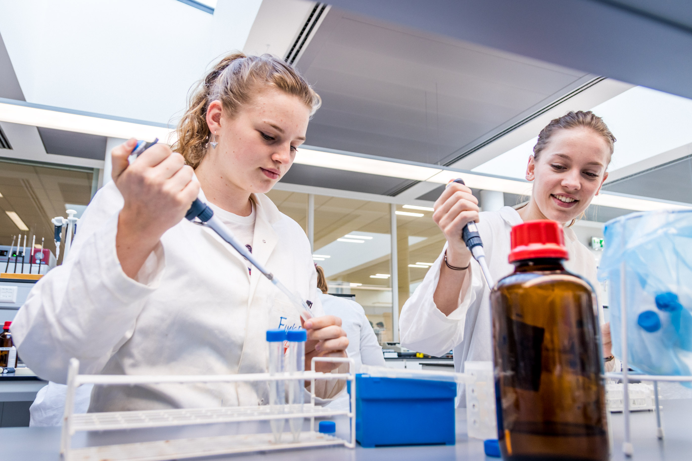

[Back to the main page of the crash course](../index.html)

# Nucleic Acid Isolation from bacteria

---

## Learning outcomes
- Pipetting in μl ranges
- Learning the principle of DNA or RNA isolation
- Quantification of DNA or RNA using the nanodrop

---
## Protocol

--- 

[Back to the main page of the crash course](../index.html)