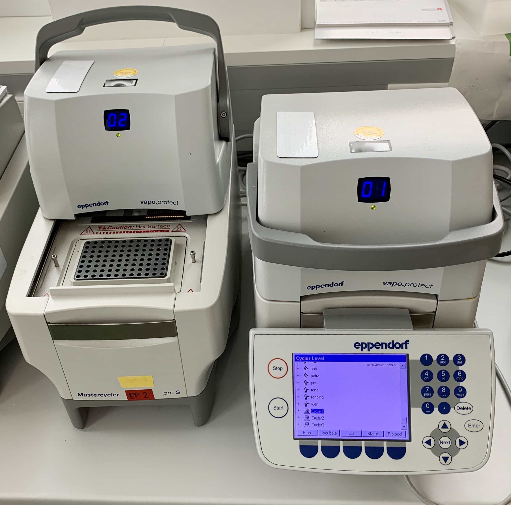

[Back to the main page of the crash course](../index.html)

# Polymerase Chain Reaction

---

## Learning outcomes
- Pipetting in μl ranges
- Learning the principle of PCR
- Amplification of DNA with the PCR reaction
- Agarose gel electrophoresis

---
## Protocol

--- 

[Back to the main page of the crash course](../index.html)