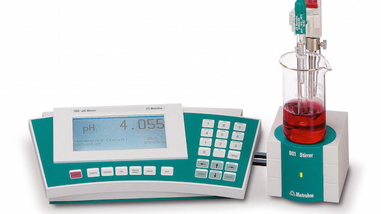
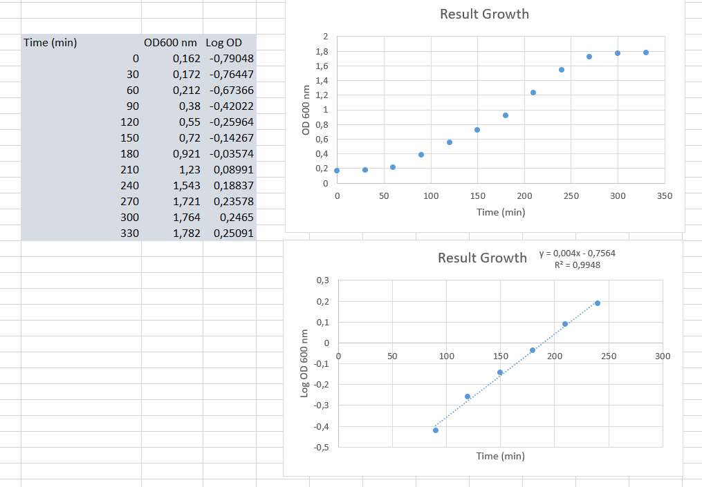

[Back to the home page of the short course](./short.html)

# Buffer preparation and the effect of pH on growth of *Escherichia coli*

## Learning outcomes
- Preparation of buffers
- Apply the Henderson-Hasselbalch equation
- Measuring pH
- Culturing bacteria using aseptic techniques
- Performing basic optical denisty (OD) measurements
- Calculating the generation time of bacteria

## Introduction and principle
A buffer solution is a solution consisting of a weak acid and its conjugate base. Buffers are used in laboratory to keep the pH stable. The pH of a buffered solution changes very little when a small amount of acid or base is added. Organisms also make extensive use of buffers. For example, blood contains a carbonic acid ($H_2CO_3$) bicarbonate ($HCO_3^-$) buffer system. 

Recall from High School that the pH is defined as the negative log of the concentration of hydrogen atoms:

$pH = -\log(H^+)$

As mentioned above, a buffer consists of a weak acid and a conjugate base:

$HA (weak\ acid) \leftrightarrow H^+ (proton) + A^- (conjugate\ base)$

The ionisation of the weak acid results in the release of a proton and the conjugate base. The reversible reaction is dependent on an equilibrium constant, $K_a$, known as the **acid dissociation constant**.

$K_a = \frac{[H^+] \cdot [A^-]}{[HA]}$

If we log transform this value we get:

${pK_{a}} =-\log({K_{a}})$

So if we combine this with the formula of the pH:

$-\log(K_a) = -\log \left (\frac{[H^+] \cdot [A^-]}{[HA]} \right)$

$pK_a = pH -\log \left (\frac{[A^-]}{[HA]} \right)$

$pH = pK_a + \log \left (\frac{[A^-]}{[HA]} \right)$
The above equation is the **Henderson–Hasselbalch equation** and can be used to estimate the pH of a buffer solution. 

## Example

Prepare a 0.1 mol/l phosphate buffer of pH 7.1.

Equation:

$H_2PO_4^- \leftrightarrow H^+ + HPO_4^{2-}$

$pK_a \ value: 6.7$

$7.1 = 6.7 + \log \left (\frac{[A^-]}{[HA]} \right)$

$0.4 = \log \left (\frac{[A^-]}{[HA]} \right)$

$2.51 = \left (\frac{[A^-]}{[HA]} \right)$

So if we prepare 0.1 mol/L $Na_2HPO_4$ and 0.1 mol/l $NaH_2PO_4$ we need ~ 2.5 times more $Na_2HPO_4$ compared to $NaH_2PO_4$.

## Buffer preparation
Note: You start with the experiment below (Effect of pH on *E. coli* growth), for which solutions will be supplied. During that experiment, you will be preparing and measuring the buffers.
- Various pH's will be prepared from 1 mol/L $NaH_2PO_4$ and 1 mol/L $Na_2HPO_4$ solutions.
- Using these solutions, you prepare 3 separate phosphate buffer solutions. Final volume = 100 ml; final concentration is 100 mM. The pH's are set at pH 5.5, 7 and 8. Use the Henderson–Hasselbalch equation to calculate the correct ratio of acid and base.
- Calibrate a pH meter. See instructions of the supplier.
- Measure the pH of your solutions.

## Effect of pH on *E. coli* growth
This experiment will be started directly.
You will receive the same buffers as that you prepared yourself (but these are sterile). There is 100 ml in 250 ml infusion flasks. In addition, you will receive 2 times concentrated growth medium (sterile, in 100 ml infusion flasks). This medium contains 2% trypton, 2% sodium chloride and 1% yeast extract. 
- Take 3 sterile 50 ml Greiner tubes (each for a pH) and label. 
- Mix the growth medium 1 to 1 with your buffer solution. Final volume in the Greiner tubes = 25 ml. What will be the strength of your buffer in the medium?
- Pre-warm the tubes at 37°C in a shaker (220 rpm) for 15 minutes.
- You will receive a pre-culture of *E. coli* from your supervisor. Measure the optical density at 600 nm by mixing 0.1 ml of the preculture with 0.9 ml blank medium in a cuvette. Mix using a 1 ml pipet. 
- Calculate how much of the pre-culture should be added to the medium to reach a OD600 of 0.15.
- Add the correct amount of bacteria to each tube and mix using a vortex.
- Incubate the tubes at 37°C in a shaker (220 rpm).
- Take a sample of 1 mL each 30 minutes for each pH and measure the OD600.

## Processing lab data using a spreadsheet
- Create a graph of the OD600 as a function of time.
- Create a graph of the Log OD600 values as a function of time.
- Perform a linear regression on the dataset that shows an exponential relationship (between OD and time) in the arithmetic plot and a linear relationship in the logarithmic plot. See example below:

- Calculate the generation time for each pH condition.

The generation time can be calculated as follows:
If $N_0$ cells are incubated for a given amount of time where the bacteria will divide $n$ times we will find:
$N = N_0 \cdot 2^n$
$N$ is the final cell number, $N_0$ is the initial cell number, and $n$ is the number of generations during the period of exponential growth.  
The slope of the regression line is equal to:

$slope = \frac{0.301}{g}$ (the number 0.301 originates from log 2)

Where `g` is the generation time (the time required to double the population). Hence:

$g = \frac{0.301}{slope}$

- Calculate the generation time for each pH.
- Plot the various generation times using a barplot in Excel.

The end...

[Back to the home page of the short course](./short.html)