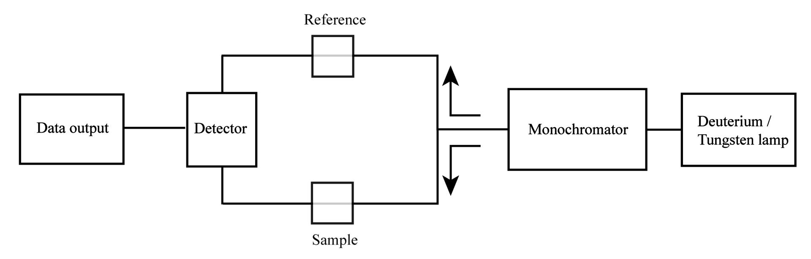
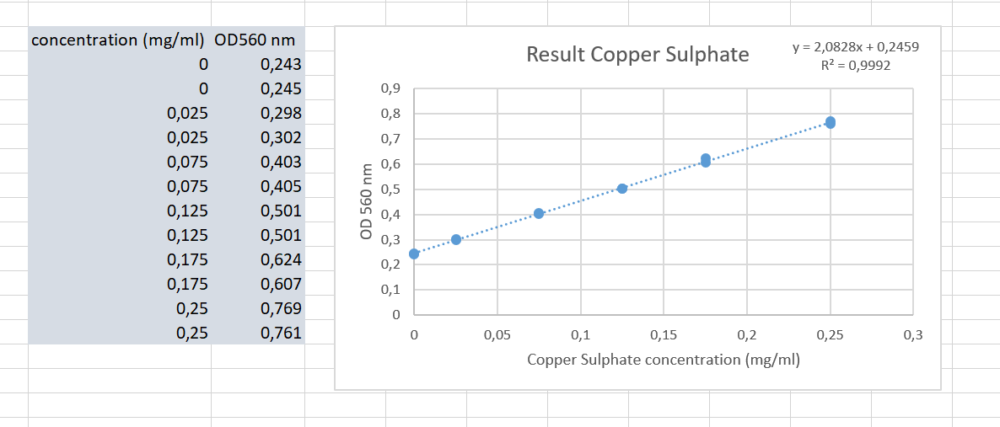

[Back to the home page of the short course](./short.html)

# Calibration curve copper sulphate

## Learning outcomes
- Weighing chemicals
- Pipetting fluids
- Performing basic OD measurements 
- Creating basic standard curves using a prdefined design
- Applying linear regression in a spread sheet

## Introduction
For this experiment, we will quantify copper sulphate $(CuSO_4)$ in a sample with an unknown concentration of copper sulphate. Copper Sulphate is blue and can be measured using a spectrophotometer at 560 nm. We will prepare a calibration curve of known copper sulphate concentrations and use a technique called **linear regression** to quantify the copper sulphate in the sample.

## Principle spectrophotometer
Spectrophotometry can be used to quantify chemicals that absorb light of a certain wavelength. A spectrophotometer measures how much a chemical substance absorbs light by measuring the intensity of light that passes through sample solution and reaches the detector. See figure below:

## Assay

> Important: always look up the safety regulations for the chemicals you use. Make a safety table as outlined below: 

|Substance|Riscs|Prevention Measures|First Aid|Waste Processing|
|:-------:|-----|-------------------|---------|----------------|
|$CuSO_4 $|     |                   |         |                |

1. Use a beaker of 200 ml and a graduated cylinder of 100 ml.
2. Weigh 5 gram $CuSO_4$ using a weighing paper. 
3. Add approximately 25 ml of demi water in the beaker and add $CuSO_4$. 
4. When dissoved, add the $CuSO_4$ in the graduated cylinder and add demi water up to 50 ml. 
5. Add the stock solution back in the beaker.
6. Calculate the concentration of the stock solution. 
7. Take 12 test tubes and lable them: 100, 75, 50, 25, 12.5 en 6.25 mg/ml (use duplicates, hence 12 tubes).
8. Pipet the calibration curve according to table 1. Calculate the missing values. Use a total volume of 1 ml. Pipet in duplicates!

|Concentration (mg/ml)|Volume stock (µl)|Volume water (µl)|
|:-------------------:|-----------------|-----------------|
|100                  |                 |                 |
|75                   |                 |                 |
|50                   |                 |                 |
|25                   |                 |                 |
|12.5                 |                 |                 |
|6.25                 |                 |                 |

9. Set the spectrophotometer to a wavelength of 560 nm
10. Fill a cuvet with 1 ml of demi water and blanc (set to zero)
11. Fill another cuvet with 1 ml of a standard curve sample and measure. Note the value in your lab journal. Do this for all standard curve samples.
12. Measure the absorption (OD) of the unknown sample.

## Processing lab data using a spreadsheet
- Plot the OD values as a function of the copper sulphate concentration. The Beer–Lambert law predicts a lineair relationship between the protein concetration and the optical density. 
- Perform a linear regression on your data using Microsoft Excel:

- Set up the linear regression equation model: $y = ax + b$
- Fill in your y-value and calculate the unknown x-value.
- Report the copper sulphate concentration in your lab journal.

The end...

[Back to the home page of the short course](./short.html)