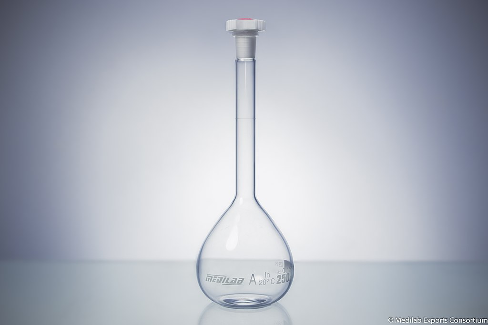

[Back to the home page of the short course](./short.html)

# Lab Equipment

On this page, you will get some information about lab equipment.

## Laboratory Glassware

Laboratory Beaker:

Erlenmeyer:

Graduated Cylinder:

Volumetric Flask:

Funnel:

Watch Glass:

Test Tube:

## Plastic disposables

Plastic disposables are often sterile.

Greiner tubes:

Eppendorf tubes:

Petri Dish:

## Pipetting

Gilson pipet:

Volumetric Pipet:

Measuring Pipet:

## Weighing of chemicals

Weighing scale:

Analytical Weighing Scale:

## Spectrophotometer

## Stereo Microscope

## Incubator

[Back to the home page of the short course](./short.html)