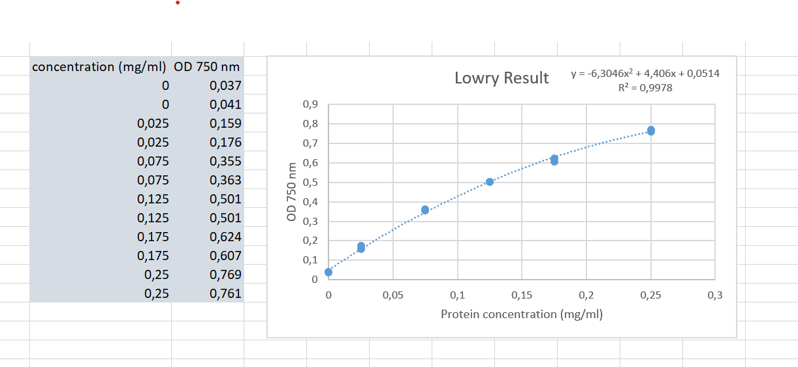

[Back to the home page of the short course](./short.html)

# The Lowry Assay

## Learning outcomes
- Weighing chemicals
- Pipetting fluids
- Designing a standard curve
- Performing OD measurements after a chemical reaction
- Applying second order regression using a spreadsheet
- Using the ABC formula to calculate the protein concentration

## Introduction
The Lowry assay (1951) is an often-cited generaly used protein assay. The modified Lowry is done entirely at room temperature which makes it easy to use for practical courses.

## Principle 
Under alkaline conditions the divalent copper ion forms a complex with peptide bonds in which it is reduced to a monovalent ion. Monovalent copper ions and the radical groups of tyrosine, tryptophan, and cysteine react with Folin reagent to produce an unstable product that becomes reduced to molybdenum/tungsten blue. The end product gives a specific absorbance at 750 nm. Proteins with an abnormally high or low percentage of tyrosine, tryptophan, or cysteine residues will give high or low errors, respectively.

$Protein + Cu^{2+} \rightarrow Protein-Cu^+_{complex} + Folin_{reagens} \rightarrow blue\ product$

## Preparation of the reagents 
1.	Dissolve 20 gr sodium carbonate in 260 ml water, 0.2 gr cupric sulfate (5x hydrated) in 20 ml water, and 0.4 gr sodium potassium tartrate tetrahydrate in 20 ml water.  Prepare the solutions separately until obtaining a clear solution. Mix all three solutions to prepare the copper reagent. 
2.	Prepare 100 ml of a 1% (w/v) solution of sodium dodecyl sulfate (SDS). 
3.	Prepare a 1 mol/L solution of NaOH in 100 mL. 
4.	For the 2x Lowry concentrate mix 3 parts copper reagent with 1 part SDS and 1 part NaOH. The solution stays stable for 2-3 weeks. Warm the solution up to 37 degrees °C if a white precipitate forms, and discard if there is a black precipitate. Better, keep the three stock solutions, and mix just before use. 
5.	Prepare 0.2 M Folin reagent by mixing 10 ml 2 M Folin reagent with 90 ml water. Kept in an amber bottle, the dilution stays stable for several months. 

## Assay 
Prepare in duplicates:
1.	Dilute samples to an estimated 0.025-0.25 mg/ml with demi-water. If the concentration can't be estimated it is advisable to prepare a range of 2-3 dilutions spanning an order of magnitude. Prepare 400 microliters each dilution. 
2.	Prepare a reference blank of 400 microliters demi-water. Prepare standards from 0.025 up to 0.25 mg/ml bovine serum albumin. (this will be used for the calibration curve)
3.	Add 400 microliters of 2x Lowry concentrate, mix thoroughly, incubate at room temp. 10 min. 
4.	Add 200 microliters 0.2 M Folin reagent very quickly, and vortex immediately. Complete mixing of the reagent must be accomplished quickly to avoid decomposition of the reagent before it reacts with protein. Incubate for 30 min. more at room temperature. 
5.	Use polystyrene cuvettes to read the absorbances at 750 nm.
6.	Determine the protein concentration of the samples by using the calibration curve performed with the standard bovine serum albumin. See the next session.

## Processing lab data using a spreadsheet

- Plot the OD values as a function of the protein concentration. The Beer–Lambert law predicts a lineair relationship between the protein concetration and the optical density. However, it is well known that the Lowry method yields a second degree polynomal line. Include correct axis titles for your graph.
- Perform a second order regression on your data using Microsoft Excel:

- Set up the second order regression equation model as $y = ax^2 + bx + c$
- Fill in your y-value and set the equation to 0.
- Use the ABC formula to calculate the protein concentration in your sample. ABC-formula: $x = \frac{-b\ \pm\ \sqrt{b^2 - 4ac}}{2a}$
- If all went well, you will end up with two results for x. Which of the two results is correct?
- Report the protein concentration in your lab journal.

The end...

[Back to the home page of the short course](./short.html)