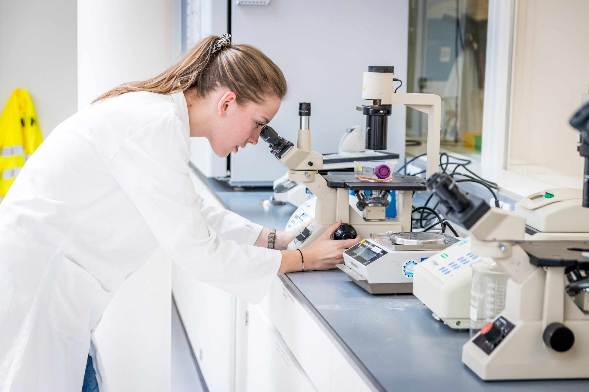

[Back to crash course](../short.html)

# Microscope Alignment for Köhler Illumination

## Instruction

- Switch on the light source.
- Rotate the nosepiece until the objective 4x is in place and place a specimen on the stage.
- Set the interpupillary distance via the folding bridge of the binocular tubes. It may be necessary to adjust the individual eyepieces to accommodate your eyesight if you are using a binocular microscope.
- Open all diaphragms as far as they will go and lift up the condenser as far as it will travel.
- Focus the specimen first with the 4x objective followed by the 10x objective by adjusting the coarse knob and fine focus knob.
- Set the condenser in the highest position.
- Close the field diaphragm. A small light spot will emerge, the image of the illuminated field diaphragm.
- Sharpen the image of the illuminated field diaphragm by lowering the condenser.
- Center the image of the illuminated field diaphragm with the condenser centering screws. This will be made easier for you if the diameter of the field diaphragm image is lying almost on top of the image of the field of view.
- Open the illuminated field diaphragm until the entire field of view is bright.
- When necessary change the aperture diaphragm. The aperture diaphragm is more closed with a smaller magnification. The value of the aperture diaphragm is most of the times indicated on the objective with NA followed by a number (0.05, 0.35, 0.65 or 0.95). 
