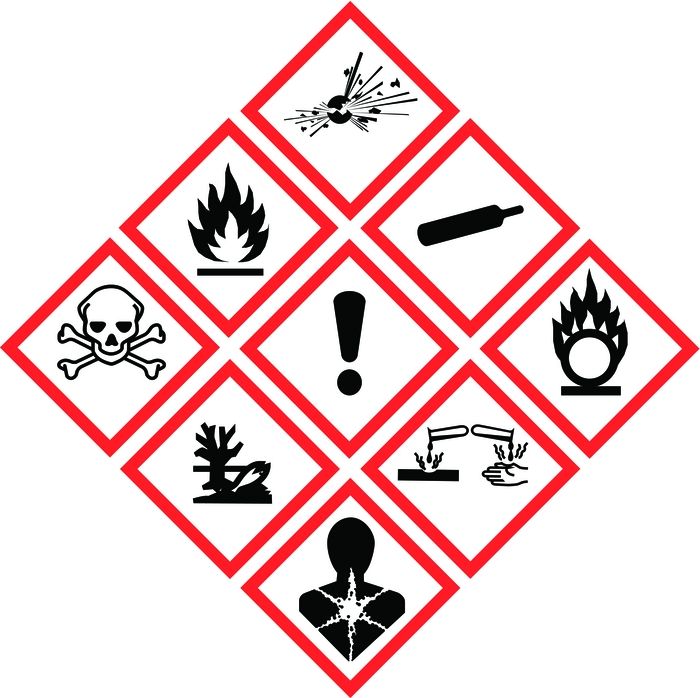

[Back to crash course](../short.html)

# General Lab Safety

## Personal Safety Instruction

>In case of EMERGENCY stop immediately the whole electrical power supply in the lab by pressing the red EMERGENCY BUTTONS

>Liquid nitrogen:
Liquid nitrogen is at least as dangerous as boiling water! Please, be careful when dealing with it
o   Always work with a tutor
o   Always wear protection glasses!
o   Always wear protective gloves!
o   Insert pieces into liquid nitrogen very slowly, otherwise the nitrogen will splash around at – 196°C/explode!

>Gas: 
When leaving the lab and/or emergency case, close the gas main valve in the corridor

>Fire: 
o   Emergency call: 050 595 1162 (112 in case of serious accident or fire)
o   Fire extinguisher: beside the lab door
o   Fire blanket: beside the lab door
o   Inform all colleagues, close windows and doors (if possible), leave the building on shortest way; call 050-595 1162

- Non-slip, closed-in footwear and laboratory coat must be worn when in a laboratory. Open footwear such as open-toed shoes are not allowed. 
- Eye protection and any other protective equipment (e.g. gloves) is defined by the individual laboratory requirements, substance information (MSDS) and how the chemical is being used. 
- Never run in the laboratory or along corridors. 
- Never indulge in reckless behaviour in the laboratory. 
- Do not carry out hazardous work in isolation in a laboratory; follow the working alone and after hours guidelines. 
- Do not handle, store or consume food or drink in the laboratory and do not store food or drink in a refrigerator which is used to store laboratory materials. 
- Never undertake any work unless the potential hazards of the operation are known as precisely as possible, and the appropriate safety precautions are adopted. 
- Always use safety carriers for transporting chemicals in glass or plastic containers with a capacity of 2 L or greater. Never carry containers of mutually reactive substances at the same time. 
- Never store mutually reactive substances in the same area. Refer to Working with Hazardous Substances Guidelines. 
- Keep only the minimum required quantities of hazardous substances in the laboratory work area.
- Always use a fume cupboard, fume cabinet or glove box when working with highly toxic, volatile or odoriferous substances. 
- Wash skin areas which come in contact with chemicals, irrespective of concentration. 
- Keep all fire-escape routes completely clear at all times. 
- Label all safety equipment and maintain it in good operating condition. Check and inspect safety equipment for correct operation in accordance with the manufacturer’s instructions and report, in writing, any requirement for maintenance. 
- Ensure that all safety equipment remains accessible to the laboratory personnel at all times. 
- Clean up spills immediately. 
- Dispose of specialized wastes (e.g. broken glassware, biological and radioactive substances) in containers reserved for the particular type of waste. Refer to Hazardous Waste Disposal Guidelines. 

## Housekeeping

>The following precautions are to be taken to ensure the safety of personnel within laboratories: 

- Floors are to be kept tidy and dry 
- Benches are to be kept clean and free from chemicals and apparatus that are not being used. 
- Aisles and exits are to be kept free from obstructions. 
- Bottles and glassware are to be kept off the floor. 
- Access to all emergency equipment (fire extinguishers, first aid kits, chemical spill kits, emergency shower and eye washes) is to be kept free from obstruction. 
- Work areas and equipment are to be thoroughly cleaned after use. 
- If last to leave the laboratory, make sure equipment is turned off, flames are extinguished. 
- The interior of fume cupboards and nearby areas are kept clean and clear. 
- All apparatus left running overnight should be shielded and labelled with name and telephone number of person to be contacted. 

