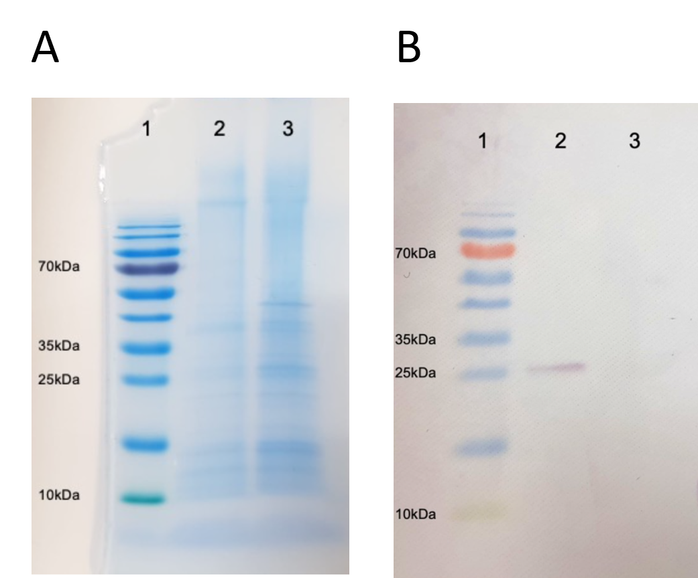

[Back to the main page of the crash course](../index.html)

# Western Blot Analysis of GFP-SKL in peroxisomes of *Hansenula polymorpha*

---

## Learning outcomes
- Concentrating proteins using TCA-precipitation.
- Electrophoresis of proteins using SDS-PAGE.
- Western blotting of proteins.
- Detection of GFP-SKL using a GFP antibody.
- Creating publication figures of the data.

---
## Protocol

--- 

[Back to the main page of the crash course](../index.html)